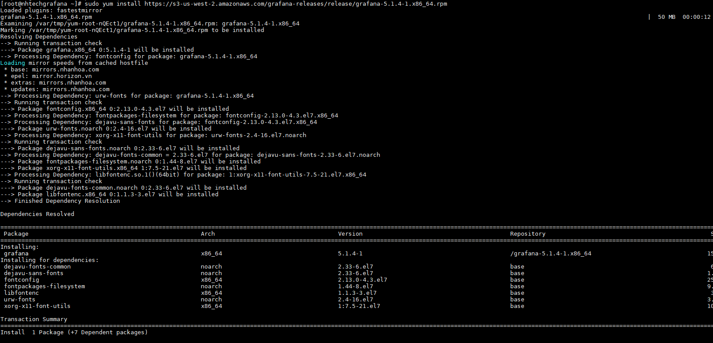
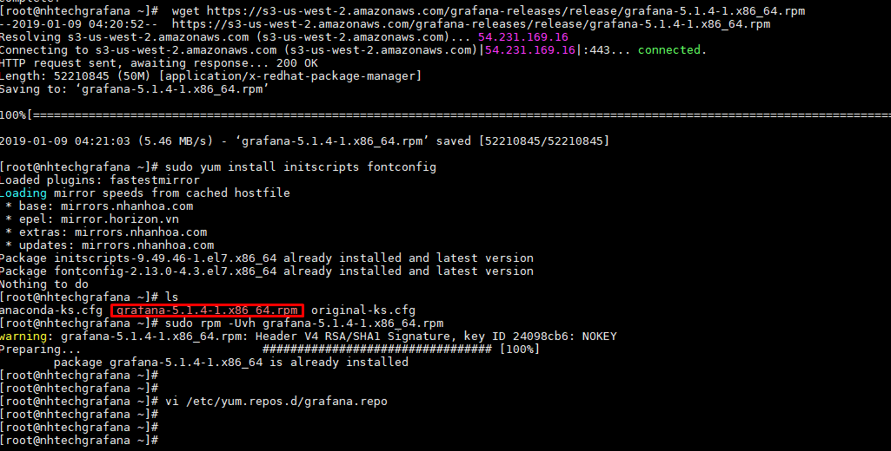
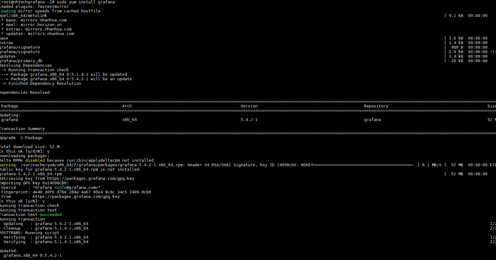
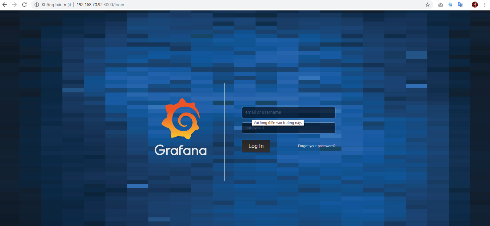

# Triển khai grafana 5.4 trên CentOS7

## Bước 1: Tải grafana ver 5.4

```
yum install wget -y

sudo yum install https://s3-us-west-2.amazonaws.com/grafana-releases/release/grafana-5.1.4-1.x86_64.rpm

wget https://s3-us-west-2.amazonaws.com/grafana-releases/release/grafana-5.1.4-1.x86_64.rpm

sudo yum install initscripts fontconfig
```



## Bước 2: Cài đặt gói rmp local



```
sudo rpm -Uvh grafana-5.1.4-1.x86_64.rpm
```
## Bước 3: Tạo repo

```
vi /etc/yum.repos.d/grafana.repo
```

Thêm nội dung

```

```
[grafana]
name=grafana
baseurl=https://packages.grafana.com/oss/rpm
repo_gpgcheck=1
enabled=1
gpgcheck=1
gpgkey=https://packages.grafana.com/gpg.key
sslverify=1
sslcacert=/etc/pki/tls/certs/ca-bundle.crt
```

## Bước 4: Cài đặt

```
sudo yum install grafana
```




## Bước 5: Cài đặt thành công và login

https://ip:3000

admin/admin




## Tham khảo

http://docs.grafana.org/installation/rpm/